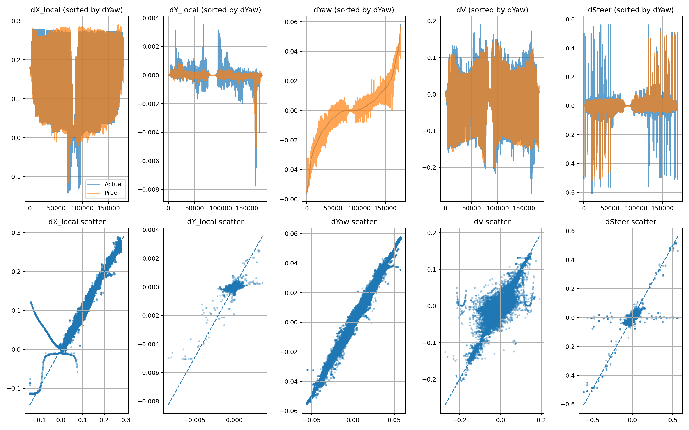

# Polaris GEM: Neural System Identification + acados NMPC

Learn the dynamics of the Polaris GEM e2 from simulator logs, then drive it with a
nonlinear MPC that uses the learned network as its prediction model.

The pipeline is three steps:

1. **Record** driving data from the ROS/Gazebo simulator to CSV
2. **Identify** a 1-step dynamics model: a small MLP that maps the current state and
   command to local-frame state deltas
3. **Control** with acados (SQP-RTI), embedding the same network inside CasADi so the
   optimizer differentiates through it



*Predicted vs. actual 1-step deltas on the held-out test split.*

## Quickstart

```bash
# 1. build the ROS Noetic + Gazebo + acados image
docker compose build

# 2. start the container (needs an X server on the host)
xhost +local:root
docker compose up -d
docker exec -it gem_mpc_container bash

# 3. inside the container, build the catkin workspace once
cd /root/catkin_ws && catkin_make && source devel/setup.bash

# 4. launch the simulator
roslaunch gem_gazebo gem_gazebo_rviz.launch

# 5. in a second shell in the same container, run the controller
python3 -m gem_mpc.mpc
```

Training and all offline analysis need neither ROS nor acados, so they also run
directly on the host:

```bash
pip install -e .
gem-train                       # or: python -m gem_mpc.train_model
```

Full environment notes are in [docs/setup.md](docs/setup.md).

## Repository layout

| Path | Contents |
|---|---|
| [src/gem_mpc/](src/gem_mpc/) | The package: controller, trainer, recorder, validator |
| [src/gem_mpc/tools/](src/gem_mpc/tools/) | Analysis and plotting helpers, manual/auto drivers |
| [src/gem_mpc/paths.py](src/gem_mpc/paths.py) | Repo-anchored paths, so scripts run from any directory |
| [data/](data/) | Recorded driving logs, ~900k samples ([schema](data/README.md)) |
| [models/](models/) | Trained weights `gem_dynamics.pth` and the input/output scalers |
| [waypoints/](waypoints/) | `wps.csv`, the reference path the controller follows |
| [results/](results/) | Run outputs: debug logs, trajectory dumps, generated plots |
| [docs/](docs/) | Setup, method and results documentation |
| [POLARIS_GEM_e2/](POLARIS_GEM_e2/) | Vendored upstream simulator (third party, see below) |

## Entry points

Installing the package (`pip install -e .`) provides four commands; each is also
runnable as `python -m gem_mpc.<module>`.

| Command | Module | What it does |
|---|---|---|
| `gem-record` | `gem_mpc.data_recorder` | Logs ROS topics to `data/gem_data_<timestamp>.csv` |
| `gem-train` | `gem_mpc.train_model` | Fits the dynamics model, writes `models/` and validation plots |
| `gem-mpc` | `gem_mpc.mpc` | Runs the NMPC ROS node |
| `gem-validate` | `gem_mpc.validate_model` | Sanity-checks the trained model against a kinematic baseline |

## Documentation

- [Setup](docs/setup.md): Docker, ROS, acados, running without a container
- [System identification](docs/system_identification.md): data format, features, targets, training
- [MPC](docs/mpc.md): OCP formulation, cost, constraints, ROS interface, tuning knobs
- [Results](docs/results.md): what the generated figures show
- [Tools](docs/tools.md): the analysis scripts and what each one is for
- [Data schema](data/README.md): CSV columns, units, sample rates

## Model at a glance

| | |
|---|---|
| Inputs (8) | `v`, `steer_actual`, `yaw_rate`, `cmd_speed`, `cmd_steer`, `dt`, `prev_cmd_speed`, `prev_cmd_steer` |
| Outputs (5) | `dx_local`, `dy_local`, `d_yaw`, `d_v`, `d_steer` |
| Network | 8 → 64 → 64 → 32 → 5, `tanh` activations |
| Control step | 50 ms (20 Hz) |
| Horizon | 20 steps (1.0 s) |
| Solver | acados SQP-RTI, `PARTIAL_CONDENSING_HPIPM`, discrete integrator |

## Third-party components

[POLARIS_GEM_e2/](POLARIS_GEM_e2/) is a vendored copy of the
[POLARIS_GEM_e2 simulator](https://github.com/hangcui1201/POLARIS_GEM_e2) from the
University of Illinois. It is included so the catkin workspace builds from a single
clone; it is not part of this project's work and keeps its own licenses (see the
`LICENSE` files inside its packages). Everything under `src/gem_mpc/` is this
project's code.
