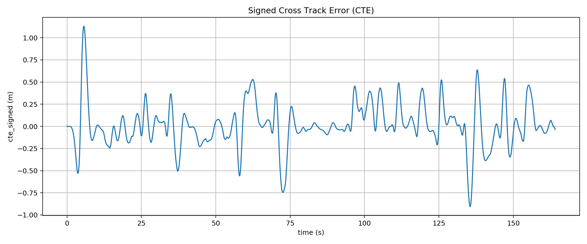
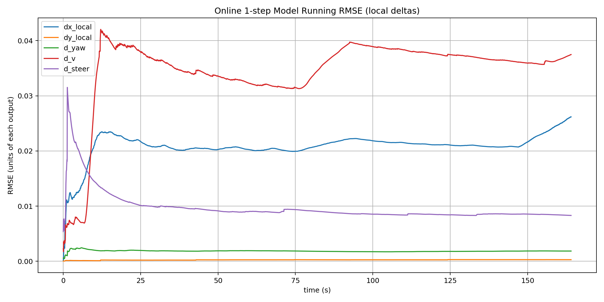
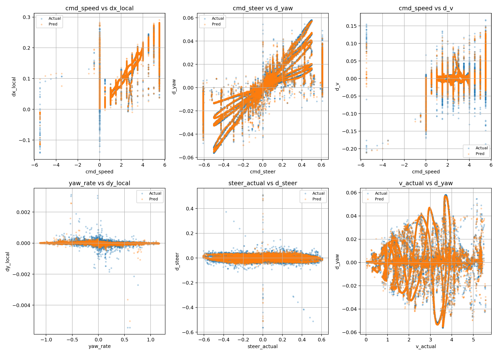
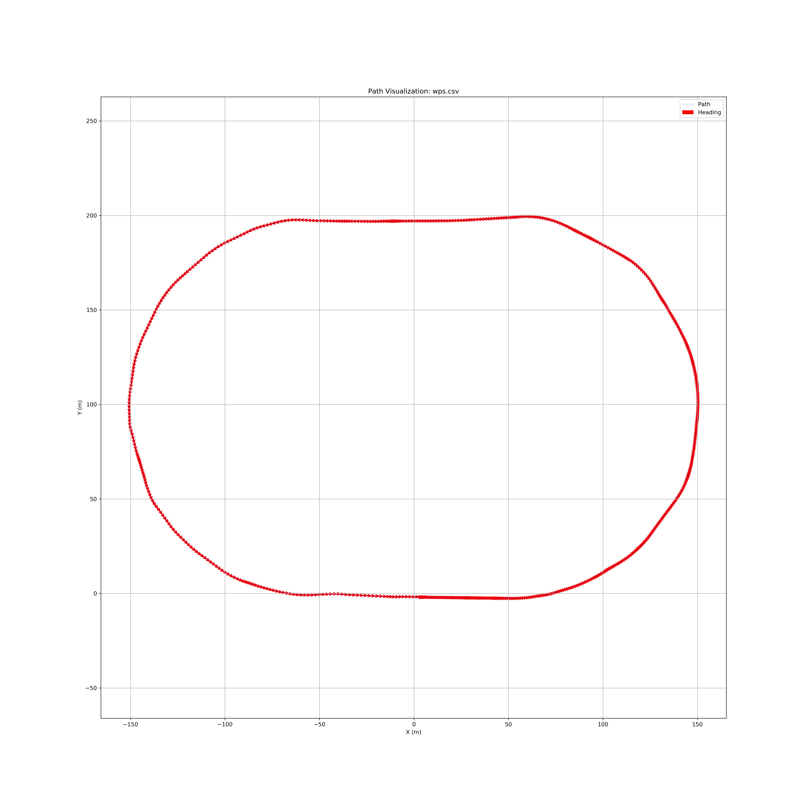
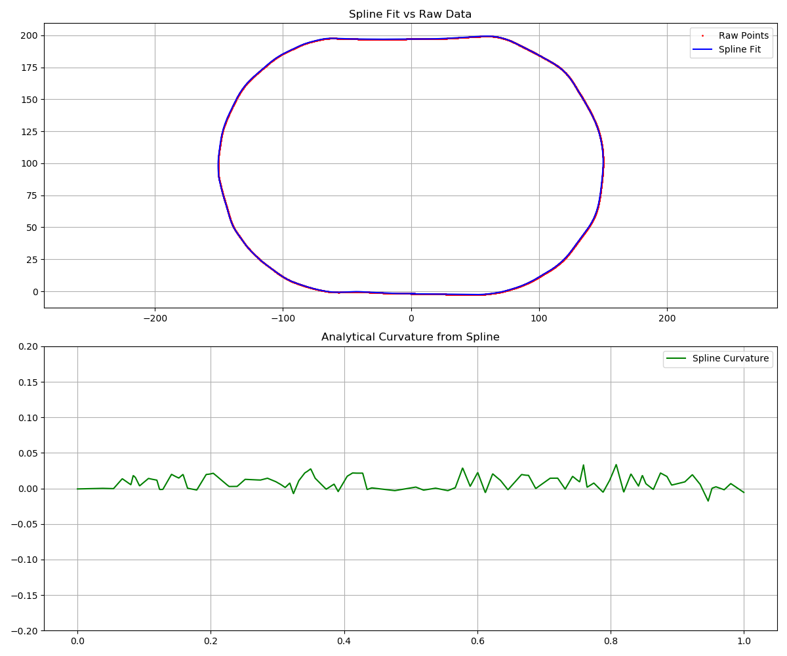
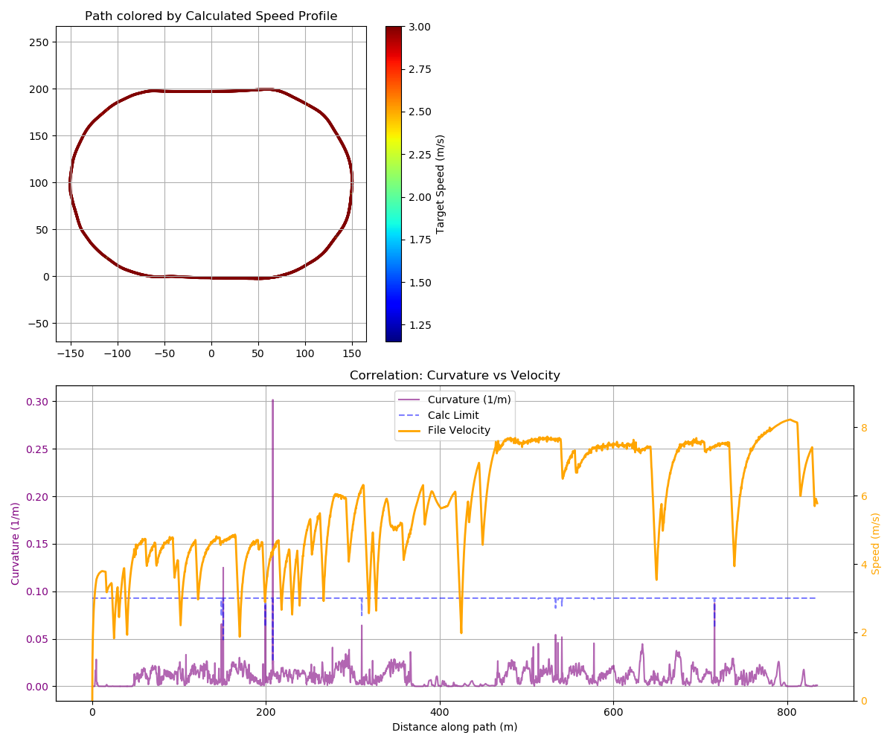
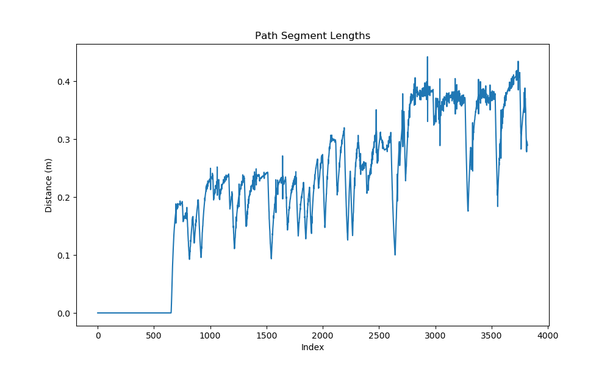
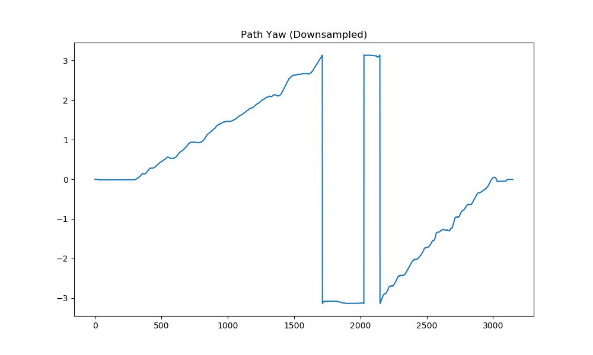
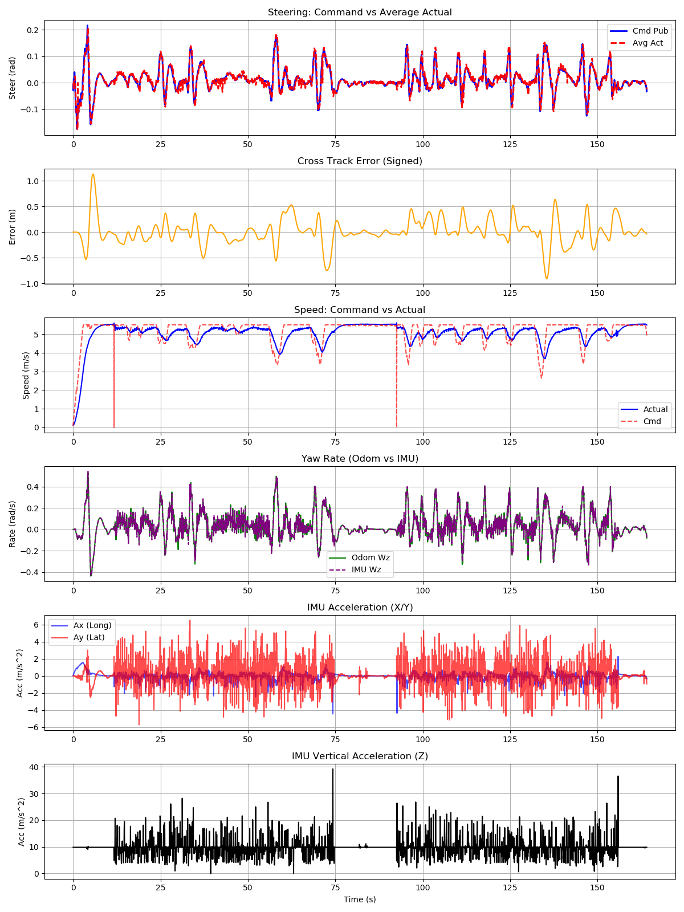

# Results

Figures in `docs/images/` are checked-in snapshots from representative runs. Running
the pipeline regenerates the equivalents into `results/`.

## Closed-loop tracking

A 165 s lap sequence. After the initial acquisition transient (about 1.1 m while the
vehicle pulls onto the path from its spawn pose), cross-track error stays inside
roughly ±0.5 m, with the larger swings at corner entry and exit where the reference
curvature changes fastest. The signal is smooth rather than jittery, which is the
visible effect of the heavy `R_steer_rate` penalty described in [mpc.md](mpc.md#cost).

Regenerate with `python -m gem_mpc.mpc`; the plot is written on shutdown.

## Online model accuracy

Running per-dimension RMSE of the 1-step prediction against what the vehicle actually
did, accumulated during the same run. Steady-state values:

| Output | RMSE | Relative to a step at 5 m/s |
|---|---|---|
| `dx_local` | ~0.021 m | 0.25 m travelled per step |
| `dy_local` | ~0.0002 m | negligible |
| `d_yaw` | ~0.002 rad | |
| `d_v` | ~0.037 m/s | |
| `d_steer` | ~0.008 rad | |

The `d_v` curve is the one to watch. It rises sharply in the first 10 s and again
around 80 s, both times during acceleration, which says longitudinal transients are
the weakest part of the fit. `dy_local` being three orders below `dx_local` reflects
the local-frame parameterisation doing its job: lateral motion within one 50 ms step
is genuinely tiny, and the heading change carries the turning information.

Since this is measured in closed loop, it also captures distribution shift: the
controller visits states the recorded data may not cover well.

## Offline fit

Predicted vs. actual deltas on the held-out 20% split, with per-dimension scatter.

RMSE broken out by the turning, accelerating and command-error subsets. This is the
plot that shows whether the [sample weighting](system_identification.md#sample-weighting)
achieved what it was for: comparable error in the turning subset and the aggregate,
rather than an aggregate flattered by straight-line driving.

## Path and reference

| Figure | Shows |
|---|---|
|  | `waypoints/wps.csv` plotted, from `tools/plot_path.py` |
|  | Periodic B-spline fit against the raw waypoints, `tools/test_spline.py` |
|  | Curvature-derived speed profile, `tools/plot_velocity_profile.py` |
|  | Waypoint spacing statistics, `tools/analyze_path.py` |
|  | Path heading continuity, `tools/check_yaw.py` |

## Diagnostics

The six-panel controller diagnostic from `tools/plot_oscillation.py`: commanded vs.
actual steering, cross-track error, speed tracking, yaw rate from odometry against the
IMU, and lateral/vertical acceleration. This is the first plot to open when the
vehicle misbehaves; the steering panel separates a control problem (command
oscillating) from a plant problem (command clean, actual lagging).

`images/crash.png`, `crash2.png` and `crash3.png` are retained failure cases from
earlier tuning, kept because they document what the failure modes look like.
`trajectory_debug_crab.png` shows a case where the predicted horizon crabs sideways,
the signature of a `dy_local` bias.

## About the bundled logs

`results/mpc_debug.csv` and `results/mpc_trajectories.pkl` are tracked in the repo,
but they are an accumulated debug log spanning about 3 hours across many sessions,
including runs that diverged. Their aggregate statistics (CTE RMSE around 5 m) are
**not** a performance figure for the controller; they are a fixture for exercising the
analysis tools. The figures above come from single clean runs.

## `mpc_debug.csv` columns

Written at 20 Hz, one row per control step.

| Column | Meaning |
|---|---|
| `time` | ROS time, s |
| `cte_signed` | Signed cross-track error, m (positive left of path) |
| `steer_cmd_pub` | Steering angle actually published, rad |
| `cmd_speed_pub` | Speed actually published, m/s |
| `steer_act` | Measured steering angle, mean of both hinges, rad |
| `yaw_rate` | Yaw rate from odometry, rad/s |
| `speed` | Measured speed, m/s |
| `ax`, `ay`, `az` | IMU linear acceleration, m/s² |
| `wz` | IMU yaw rate, rad/s |
| `last_cmd_v`, `last_cmd_steer` | Previous step's commands, the `prev_cmd_*` model inputs |
