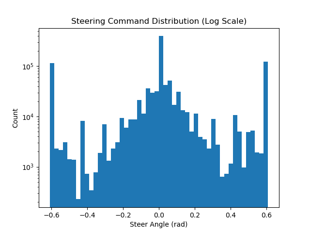
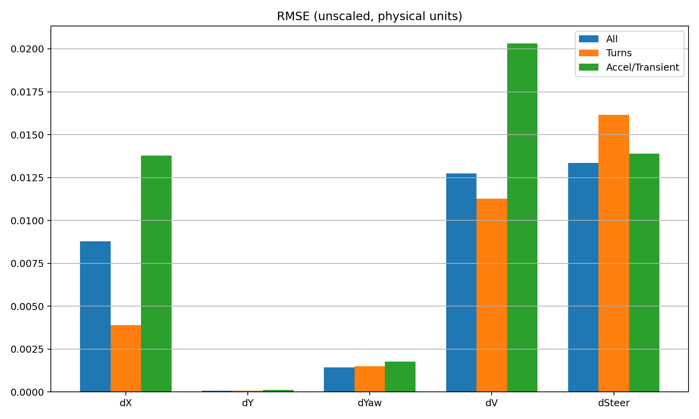

# System identification

The goal is a discrete 1-step dynamics model good enough to serve as the prediction
model inside an NMPC running at 20 Hz. Implementation:
[src/gem_mpc/train_model.py](../src/gem_mpc/train_model.py).

## Why learn instead of using a bicycle model

The GEM's steering column has its own lag and rate limits, and the Gazebo drivetrain
does not track speed commands instantly. A kinematic bicycle model predicts where the
vehicle goes given the *actual* steering angle, but the controller can only choose the
*commanded* one. The learned model absorbs both actuator lags, so the optimizer plans
in terms of the commands it can actually issue.

## Recording

```bash
python -m gem_mpc.data_recorder            # or: gem-record
```

[data_recorder.py](../src/gem_mpc/data_recorder.py) subscribes to
`/gem/ackermann_cmd`, `/gazebo/model_states` and `/gem/joint_states`, and appends one
row per `model_states` message (about 1 kHz). On shutdown it writes
`data/gem_data_<timestamp>.csv`. Pass `--out` to choose the path.

Actual steering is the mean of the `left_steering_hinge_joint` and
`right_steering_hinge_joint` positions; steering rate is the mean of their velocities.

To excite the dynamics, drive with either helper while the recorder runs:

```bash
python -m gem_mpc.tools.manual_driver      # keyboard teleop
python -m gem_mpc.tools.auto_driver        # scripted sweeps
```

Coverage matters more than volume. `tools/inspect_data.py` reports the straight vs.
turning split; on the bundled logs it is 32.5% straight and 67.5% turning at a
`abs(cmd_steer) >= 0.05` threshold, which is a deliberately steering-rich dataset.



The histogram is log-scaled, and the bulk still sits near zero steering; the split
above counts anything past a small deadband as turning. Large steering angles remain
comparatively rare, which is what the sample weighting below compensates for.

The CSV schema is documented in [data/README.md](../data/README.md).

## Preprocessing

`load_and_process_data` does the following per file:

1. **Pair samples one control step apart.** Logs come in at ~1 kHz but the controller
   runs at `TARGET_DT = 0.05`, so a stride is computed from the median raw `dt`
   (typically 50) and each row is paired with the row `stride` ahead as its target and
   the row `stride` behind for the previous command.

   This is a sliding window, not decimation: every raw row starts a sample, so the
   1 kHz log yields roughly as many training samples as it has rows, with overlapping
   0.05 s windows offset by 1 ms.
2. **Filter.** Samples are kept only when the realised `dt` falls inside
   `TARGET_DT ± DT_TOL` (0.01) and the vehicle is moving (`v_actual > 0.01`). The `dt`
   window keeps that input tightly clustered around the value the MPC will use;
   dropping stationary samples avoids swamping the fit with rows where nothing happens.
3. **Build the input vector** from the current sample and the previous command.
4. **Build the target** as the state change from the current to the next sample,
   rotated into the vehicle frame.
5. **Drop non-finite rows**, which removes the leading rows where the previous command
   is undefined.

The bundled logs give 897,470 samples from 898,270 raw rows.

> **Caveat on the test split.** Because the windows overlap at 1 ms offsets, adjacent
> samples are nearly identical, and a random 80/20 split puts near-duplicates on both
> sides. Held-out RMSE is therefore optimistic; it measures interpolation, not
> generalisation to new driving. The closed-loop RMSE that `mpc.py` accumulates online
> ([results](results.md#online-model-accuracy)) is the more honest number. Splitting by
> file or by contiguous time block would fix this.

### Inputs (8D)

| Index | Feature | Meaning |
|---|---|---|
| 0 | `v_actual` | measured speed, m/s |
| 1 | `steer_actual` | measured steering angle, rad |
| 2 | `yaw_rate` | measured yaw rate, rad/s |
| 3 | `cmd_speed` | commanded speed, m/s |
| 4 | `cmd_steer` | commanded steering angle, rad |
| 5 | `dt` | realised timestep, s |
| 6 | `prev_cmd_speed` | command issued one step earlier |
| 7 | `prev_cmd_steer` | command issued one step earlier |

Indices 6 and 7 are what let the network represent actuator lag: the response to a
command depends on what the actuator was already doing.

### Targets (5D)

| Index | Target | Meaning |
|---|---|---|
| 0 | `dx_local` | forward displacement in the vehicle frame, m |
| 1 | `dy_local` | lateral displacement in the vehicle frame, m |
| 2 | `d_yaw` | heading change, rad, wrapped to (-pi, pi] |
| 3 | `d_v` | speed change, m/s |
| 4 | `d_steer` | steering angle change, rad |

Targets are **local-frame deltas**, not absolute poses. The global displacement is
rotated back by the mid-step heading `yaw + 0.5 * d_yaw` rather than the start
heading; this trapezoidal convention removes most of the curvature bias over a step
and is mirrored exactly in the MPC's CasADi model, so training and prediction agree.

Because the targets are frame-relative, the model is translation and rotation
invariant: it generalises to parts of the map it never saw.

## Augmentation and splitting

The split happens **before** augmentation and scaling, so no mirrored twin of a
training sample can leak into the test set and the scalers never see test statistics.

- `train_test_split(test_size=0.2, random_state=seed)`
- `mirror_augment` then doubles the training set by negating every lateral quantity
  (`yaw_rate`, `cmd_steer`, `steer_actual`, `dy_local`, `d_yaw`, `d_steer`), which
  encodes the symmetry of the vehicle and compensates for tracks that turn mostly one
  way
- `StandardScaler` for inputs and outputs, fit on the training split only, saved to
  `models/gem_scaler.pkl` and `models/gem_scaler_arrays.npz`

The `.npz` copy exists because unpickling scikit-learn objects is version-fragile;
both `mpc.py` and `validate_model.py` fall back to the raw arrays if the pickle fails
to load.

## Sample weighting

Straight-line cruising dominates any recorded dataset, and an unweighted fit
optimises for exactly the regime where the model matters least. Samples are weighted
up in the three regimes the controller depends on:

| Constant | Value | Applied when |
|---|---|---|
| `K_TURN` | 20.0 | `abs(d_yaw) > TURN_DYAW_THRESH` (0.005 rad/step) |
| `K_ACCEL` | 10.0 | `abs(d_v) > ACCEL_DV_THRESH` (0.02 m/s per step) |
| `K_CMDERR` | 10.0 | `abs(cmd_speed - v) > CMDERR_THRESH` (0.3 m/s) |
| `WEIGHT_CAP` | 50.0 | ceiling on the combined weight |

The `K_CMDERR` term targets transients: moments when the command and the measured
state disagree are precisely where actuator lag is observable.

## Network and training

```
Linear(8, 64)  -> Tanh
Linear(64, 64) -> Tanh
Linear(64, 32) -> Tanh
Linear(32, 5)
```

`tanh` throughout, deliberately: the whole network is re-expressed as a CasADi
expression inside the MPC, and `tanh` is smooth and cheap to differentiate. A ReLU
network would give the SQP solver a nondifferentiable prediction model.

The architecture is small on purpose. It is evaluated 20 times per solve at 20 Hz,
and its Jacobian is needed at every node.

| Setting | Default | Flag |
|---|---|---|
| Epochs | 8000 | `--epochs` |
| Learning rate | 0.005 | `--lr` |
| Early-stopping patience | 150 | `--patience` |
| Seed | 42 | `--seed` |
| Data directory | `data/` | `--data-dir` |

```bash
gem-train                                  # all defaults
gem-train --epochs 2000 --data-dir /path/to/logs
```

Outputs: `models/gem_dynamics.pth`, `models/gem_scaler.pkl`,
`models/gem_scaler_arrays.npz`, plus three figures in `results/`.

## Checking the fit

`results/sysid_validation_plot.png` overlays predicted and actual deltas on the test
split with per-dimension scatter; `results/sysid_input_output.png` gives an
input/output overview; `results/rmse_plot.png` breaks RMSE down by the turning,
accelerating and command-error subsets, which is the plot that tells you whether the
weighting did its job.



Two extra checks:

```bash
python -m gem_mpc.tools.model_check    # test-split RMSE and bias per output dimension
python -m gem_mpc.validate_model       # open-loop probes against a kinematic baseline
```

`model_check.py` reports bias as well as RMSE, which matters here: a small constant
bias in `d_yaw` integrates into a steady cross-track offset over a horizon.

> **Note on `validate_model.py`:** its probes run at `DT = 0.1`, while the model is
> trained on samples filtered to `dt = 0.05 ± 0.01`. Since `dt` is an input feature
> whose training distribution is nearly a point mass, a 0.1 probe is far outside the
> data and the reported failures should not be read as a verdict on the model. Use
> `model_check.py` for an in-distribution assessment.
